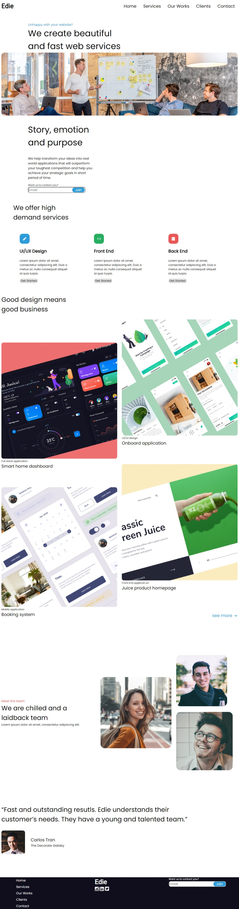

<h1 align="center">{Edie Homepage Master}</h1>

<div align="center">
   Solution for a challenge from  <a href="http://devchallenges.io" target="_blank">Devchallenges.io</a>.
</div>

<div align="center">
  <h3>
    <a href="https://tourmaline-gumption-427bb1.netlify.app/">
      Demo
    </a>
    <span> | </span>
    <a href="https://github.com/im-victor-mendez/CSS-Edie_Homepage_Master">
      Solution
    </a>
    <span> | </span>
    <a href="https://devchallenges.io/challenges/xobQBuf8zWWmiYMIAZe0">
      Challenge
    </a>
  </h3>
</div>

<!-- TABLE OF CONTENTS -->

## Table of Contents

- [Overview](#overview)
  - [Built With](#built-with)
- [Features](#features)
- [How to use](#how-to-use)
- [Projects](#projects)
- [Contact](#contact)

<!-- OVERVIEW -->

## Overview



- Where can I see your demo?
    Live (Overview): [Netlify](https://tourmaline-gumption-427bb1.netlify.app/)
    Code: [GitHub](https://github.com/im-victor-mendez/CSS-Edie_Homepage_Master)

- What was your experience?
    Time taked: Aproximate 8 hours.
    Difficult: Hamburger menu.

- What have you learned/improved?
    Take an element from HTML in the same file, I cannot had access in js file.
    I was taking null value.

### Built With

- HTML
- CSS
- JavaScript
- GitHub

## Features

This application/site was created as a submission to a [DevChallenges](https://devchallenges.io/challenges) challenge. The [challenge](https://devchallenges.io/challenges/xobQBuf8zWWmiYMIAZe0) was to build an application to complete the given user stories.

## How To Use

<!-- Example: -->

To clone and run this application, you'll need [Git](https://git-scm.com) and [Node.js](https://nodejs.org/en/download/) (which comes with [npm](http://npmjs.com)) installed on your computer. From your command line:

```bash
# Clone this repository
$ git clone https://github.com/im-victor-mendez/CSS-Edie_Homepage_Master

# Install dependencies
$ npm install

# Run the app
$ npm start
```

## Projects

- [LinkedIn](https://www.linkedin.com/in/victor-manuel-mendez-colin-72064a1a7/)
- GitHub [@im-victor-mendez](https://github.com/im-victor-mendez)
- Codepen [im-victor-mendez](https://codepen.io/im-victor-mendez)
- Netlify [im-victor-mendez](https://app.netlify.com/teams/im-victor-mendez/overview)